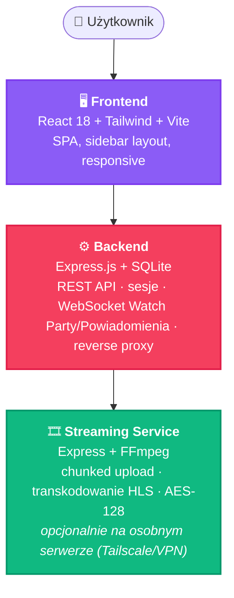

<div align="center">

# 🎬 ALLERIA FILMY

**Prywatna platforma wideo społeczności [Alleria.pl](https://alleria.pl)**

   

</div>

---

Uwierzytelnianie Discord/TeamSpeak 3/6 (z łączeniem i scalaniem kont), zarządzanie filmami, self-hosted streaming HLS, kategorie, subkategorie (3 poziomy) i system rang, kontrola dostępu oparta na rolach, komentarze z moderacją i reakcjami, planowane publikacje, centrum powiadomień w czasie rzeczywistym (+ push w przeglądarce i e-mail), analityka wideo, Shorts, Watch Party, casting (Chromecast/AirPlay), zgodność z RODO/LGPD (eksport i usunięcie danych) oraz edytowalny w panelu Regulamin.

## 📑 Spis treści

- [✨ Funkcjonalności](#-funkcjonalności)
- [👥 Role i dostęp do stron](#-role-i-dostęp-do-stron)
- [📐 Architektura](#-architektura)
- [✅ Wymagania](#-wymagania)
- [🚀 Instalacja](#-instalacja)
- [🔧 Konfiguracja `.env`](#-konfiguracja-env)
- [📋 Ustawienia w aplikacji](#-ustawienia-w-aplikacji-zarządzanie--ustawienia)
- [🌐 Streaming na osobnym serwerze](#-streaming-na-osobnym-serwerze)
- [📦 Struktura plików](#-struktura-plików)
- [💾 Baza danych (SQLite)](#-baza-danych-sqlite)
- [🔌 API Endpoints](#-api-endpoints)
- [🧱 Technologie](#-technologie)
- [📄 Licencja](#-licencja)

---

## ✨ Funkcjonalności

### 🔐 Uwierzytelnianie
- **Discord OAuth2** — logowanie przez Discord, sprawdzanie ról, automatyczne przypisywanie uprawnień (member/admin/dev)
- **TeamSpeak 6** — logowanie przez ServerQuery HTTP API, dopasowanie po IP klienta, sprawdzanie grup serwera
- **TeamSpeak 3** — logowanie przez ServerQuery po TCP, ta sama logika dopasowania po IP i grupach co TS6
- **Bot do uwierzytelniania ServerQuery** — kod logowania wysyłany na TS3/TS6 przychodzi od `TS_BOT_NICKNAME`
- **Redirect po logowaniu** — niezalogowany użytkownik wchodzący na `/video/24` zostaje przekierowany na login, a po zalogowaniu wraca na `/video/24`
- **Konfiguracja logowania w panelu albo w `.env`** — dane połączenia TS3/TS6 oraz role Discord member/admin można trzymać wyłącznie w `.env` (domyślnie) albo w pełni edytować z Zarządzanie → Ustawienia → Logowanie bez restartu kontenera (`TS_CONFIG_SOURCE` / `DISCORD_ROLES_CONFIG_SOURCE`); rola `dev` zawsze zostaje tylko w `.env`

### 🔗 Łączenie i scalanie kont
- W Profilu można dopiąć dodatkową metodę logowania (Discord / TeamSpeak 3 / TeamSpeak 6) do już posiadanego konta
- Jeśli dopinana tożsamość należy już do innego, istniejącego konta, zamiast cichego połączenia powstaje **propozycja scalenia** — porównanie statystyk obu kont i wymagane jawne potwierdzenie, zanim komentarze/filmy/historia zostaną złączone w jedno konto
- Odpięcie metody logowania jest możliwe, dopóki nie jest to jedyny pozostały sposób zalogowania się na konto

### 🔍 Smart wyszukiwanie
- **Cmd/Ctrl+K** — command palette z wyszukiwaniem tytułów, opisów, autorów i tagów filmów, dynamicznie i na żywo
- **Wyszukiwanie stron i funkcji** — Profil, Historia, Ustawienia itd. też są wyszukiwalne; redaktorzy i deweloperzy widzą więcej wyników (dopasowanych do swoich uprawnień); definicje wyszukiwalnych pozycji leżą przy definicji zakładek każdej strony (np. `MANAGE_SEARCH_ITEMS` w `ManagePage.jsx`), więc dodanie nowej zakładki od razu czyni ją wyszukiwalną
- **Dopasowanie tagów odporne na interpunkcję** — np. zapytanie „REPO” znajdzie tag „R.E.P.O.”, ale „GTA VI” celowo **nie** dopasuje „GTA V”
- **Górny pasek (tytuł + wyszukiwarka + profil)** można całkowicie wyłączyć w Zarządzanie → Ustawienia → Wyświetlanie — wtedy strony wracają do własnych, dużych nagłówków, a profil użytkownika trafia z powrotem do lewego dolnego rogu sidebaru

### 🎬 Filmy
- **YouTube/Embed** — wklejanie linków YouTube z auto-konwersją na embed i smart thumbnailami
- **Self-hosted streaming** — upload plików wideo (do 6GB), chunked upload (50MB kawałki dla Cloudflare Tunnel), transkodowanie HLS multi-quality (1080p/720p/480p/360p)
- **Szyfrowanie AES-128** — pliki HLS szyfrowane, klucze dostarczane z tokenem sesji
- **Mirrory** — do 5 alternatywnych źródeł z opcją embed/iframe; każdy mirror może być oznaczony jako „wersja alternatywna" (inny cut/behind-the-scenes), renderowana w playerze jako osobno kolorowana zakładka
- **Casting** — Chromecast (Cast Sender SDK) i AirPlay bezpośrednio z self-hosted playera; krótkotrwały (6h), podpisany token castowania pozwala urządzeniu odbiorczemu grać strumień bez ciasteczka sesji przeglądarki
- **Tagi** — system tagów z autocompletem, chip-based input
- **Planowane publikacje** — film z datą publikacji w przyszłości jest niewidoczny dla zwykłych użytkowników (widzą go tylko redaktorzy/dev w panelu) do momentu jej nadejścia; z chwilą publikacji automatycznie leci webhook Discord, powiadomienie push i/lub e-mail — każdy kanał osobno włączany per kategoria (patrz sekcje niżej)
- **Progres uploadu** — podwójny progress bar: całość + bieżący chunk
- **Auto-transkodowanie** — backend co 30s sprawdza status, redaktor widzi % postępu i aktualną jakość
- **Podgląd poklatkowy miniaturki** — najechanie myszką na kafelek filmu (self-hosted, ready) pokazuje "filmstrip" ze sprite'a wygenerowanego przy transkodowaniu (do 100 klatek co ~10-60s zależnie od długości filmu), jak na YouTube; YouTube/embed zostaje przy statycznej miniaturce

### 📊 Analityka wideo *(dla autorów, admin/dev)*
- Dostępna z poziomu strony filmu (ikonka wykresu, tylko dla autora/redaktora/dev)
- **Oglądalność w czasie** — dzienny wykres wyświetleń, ostatnie 30 dni
- **Heatmapa retencji** — jaki odsetek widzów dotarł do danego momentu filmu
- **Heatmapa interakcji** — najczęstsze pauzy, cofnięcia (ponowne obejrzenie) i pominięcia (skip), rozłożone po osi czasu filmu
- Działa dla każdego źródła, YouTube włącznie — `SecurePlayer` (self-hosted) raportuje prawdziwe zdarzenia DOM play/pause/seek, a oba odtwarzacze YouTube (IFrame API) wykrywają je w tle: play/pause z `onStateChange`, seek z wykrycia skoku w odpytywanej pozycji (bez własnego playera widocznego dla usera — działa też przy natywnych kontrolkach YT)
- **Solo vs Watch Party** — każde zdarzenie i wyświetlenie oznaczone kontekstem; przełącznik filtruje widok między „Wszystko" / „Solo" / „Watch Party" (uczestnicy party też trafiają do `watch_logs`, nie tylko osoba sterująca)
- **Filtr osoby** — zawężenie wszystkich wykresów do sesji jednej wybranej osoby
- **Statystyki zbiorcze** — unikalni widzowie, średnie ukończenie (%)
- **Reset danych** — usunięcie zdarzeń/wyświetleń filmu w całości albo zawężone do okresu i/lub jednej osoby; nie rusza zapamiętanej pozycji „Kontynuuj oglądanie"

### 🎞️ Shorts
- Kategoria oznaczona jako „Kategoria Shortów" (Zarządzanie → Kategorie) — może być ich wiele
- Przeglądanie kategorii wygląda normalnie (siatka filmów); kliknięcie filmu uruchamia sekwencyjny odtwarzacz pełnoekranowy zamiast strony filmu
- Format dowolny — Shorty nie muszą być pionowe, mogą być zwykłymi poziomymi filmami w krótkiej, szybkiej kolejce
- Nawigacja: scroll-snap (swipe na telefonie, scroll na desktopie) + strzałki góra/dół na desktopie, autoplay aktywnego slajdu przez `IntersectionObserver`
- Domyślnie zapętla bieżący film; przełącznik w playerze zmienia na automatyczne odtwarzanie kolejnego po zakończeniu
- Wyciszenie pamiętane między filmami; przycisk polubienia (współdzielony z Ulubionymi) w każdym slajdzie
- Na mobilce: zredukowany interfejs playera (tytuł, przycisk wyciszenia, zawsze widoczny przeciągalny pasek postępu) zamiast pełnych kontrolek desktopowych

### 🎉 Watch Party *(BETA)*
- **Wspólne oglądanie** — synchronizacja odtwarzania w czasie rzeczywistym przez WebSocket
- **Tworzenie/dołączanie** — 6-znakowy kod zaproszenia lub link; slide-out panel dostępny z każdej strony
- **Kolejka filmów** — dodawanie filmów z biblioteki do wspólnej kolejki z wyborem źródła; host może zarządzać kolejką
- **Synchronizacja** — play/pause/seek rozgłaszane natychmiastowo do wszystkich uczestników; korekcja dryfu co 15s
- **Kontrola per-użytkownik** — host może nadać prawo sterowania odtwarzaczem i kolejką dowolnemu uczestnikowi
- **Host controls** — wyrzucanie uczestników, zakończenie party
- **YouTube IFrame API** — pełna synchronizacja YouTube (seek, play, pause) przez oficjalne IFrame API; detekcja seeków przez polling
- **HLS Player sync** — synchronizacja SecurePlayera przez bezpośrednie wywołania kontrolera (bez cyklu React)
- **Auto-dołączanie** — wejście na `/watch-party?join=KOD` automatycznie dołącza do party
- **Informacje o rozłączeniu** — osobne ekrany dla wyrzucenia i zakończenia party

### 🔔 Centrum powiadomień
- Dostarczanie w czasie rzeczywistym przez WebSocket (osobny kanał od Watch Party, `/ws/notifications`), nie polling
- Typy: nowy film w obserwowanej kategorii, odpowiedź na komentarz, wynik żądania RODO, rozstrzygnięcie zgłoszenia komentarza
- Dzwonek z licznikiem nieprzeczytanych w górnym pasku; „Oznacz wszystkie jako przeczytane"
- Desktop: dropdown zakotwiczony pod dzwonkiem. Mobile: pełnoekranowy panel (portalowany do `<body>`, żeby nie ucinał go `backdrop-blur` górnego paska)
- Auto-reconnect przy zerwaniu połączenia

### 📲 Powiadomienia push (przeglądarka)
- Web Push (VAPID) — klucze generowane automatycznie przy pierwszym użyciu i trzymane w bazie, zero ręcznej konfiguracji
- Włączane per użytkownik w Profilu (wymaga zgody przeglądarki); dostarczane przez lekki service worker (`frontend/public/sw.js`)
- Kategoria ma własny przełącznik push — wysyłka trafia tylko do osób, które realnie mają dostęp do tej kategorii, gdy film osiąga datę publikacji; nieaktywne/wygasłe subskrypcje są automatycznie sprzątane

### 📧 Powiadomienia e-mail
- SMTP konfigurowany w panelu (Zarządzanie → Ustawienia → E-mail), bez potrzeby zmiennych `.env`
- Cztery szablony treści, wspólne dla całej platformy (nie per kategoria): nowy film, powiadomienie deva o nowym zgłoszeniu RODO, wynik eksportu RODO, wynik usunięcia konta — każdy z podglądem HTML na żywo i testową wysyłką przed zapisem
- Kategoria ma tylko przełącznik wł./wył. — treść zawsze bierze się z sitewide szablonu „nowy film", nie z ustawień samej kategorii
- **Inny zasięg niż webhook/push**: e-mail o nowym filmie leci do każdego, kto ma włączone powiadomienia mailowe w Profilu, **niezależnie od tego, czy realnie ma dostęp do danej kategorii** — webhook Discord i push filtrują odbiorców po dostępie, kanał e-mail tego nie robi
- Użytkownik włącza/wyłącza i ustawia adres kontaktowy w Profilu → Powiadomienia

### 🛡️ Ochrona DRM
- Szyfrowanie AES-128 HLS
- Header `Permissions-Policy: display-capture=()`
- Watermark z nazwą użytkownika
- Blokada: devtools, right-click, PrintScreen, PiP, keyboard shortcuts
- Pauza przy utracie focusu okna

### 💬 Komentarze
- Komentarze pod każdym filmem z obsługą wątków (odpowiedzi)
- Edycja własnych komentarzy z historią edycji
- Soft-delete (usunięty komentarz zachowany dla integralności wątku)
- Hard-delete i ciche edycje dla deweloperów (bez śladu)
- Komentarze redaktora wstawiane przez panel Debug Tools
- **Reakcje emoji** — dowolna liczba różnych emoji na komentarz, toggle per emoji (jak na Slacku)
- **Zgłaszanie komentarzy** — powód z listy (spam / nękanie / spoiler / nieodpowiednia treść / inne) lub „inne” z własnym opisem; opis zawsze wymagany
- **Kolejka moderacyjna** (Zarządzanie → Zgłoszenia, `admin`+`dev`) — trzy akcje jasno rozróżnione: *odrzuć zgłoszenie* (komentarz bez zmian), *ukryj komentarz* (soft-delete, odwracalne przez dev), *usuń trwale* (hard-delete wraz z odpowiedziami, tylko `dev`, nieodwracalne)

### 🏅 Rangi aplikacji (App Ranks)
- Własne rangi niezależne od ról Discord — nazwa, kolor, opcjonalny opis
- Rangi **same w sobie nie dają dostępu do niczego** — dopiero kategoria musi jawnie wskazać, które rangi mają dostęp jako widz lub redaktor
- Przypisywanie rang użytkownikom w „Zarządzanie” → Użytkownicy (dev only)
- Zarządzanie rangami (tworzenie/edycja/usuwanie) w „Zarządzanie” → Kategorie

### 🗂️ Kategorie i podkategorie
- Drzewo kategorii z podkategoriami (`parent_id`) w sidebarze, filtrowanie filmów po kategorii, badge kategorii na kafelkach
- Kontrola dostępu **osobno dla widza i redaktora**, niezależnie skonfigurowana jednym z trybów: publiczny / role Discord / rangi aplikacji / ręczna lista użytkowników
- Puste role widzów = kategoria publiczna dla wszystkich zalogowanych
- **Powiadomienia webhook Discord** — każda kategoria może mieć własny webhook URL, szablon wiadomości z placeholderami `{title}`, `{author}`, `{category}`, `{description}`, `{date}`, `{id}`, `{url}` oraz osobny przełącznik włączający wysyłkę; leci automatycznie, gdy film osiąga swoją datę publikacji; chronione SSRF-guardem (przełącznik „Ograniczenie domen webhooków” w Ustawieniach ogranicza cele do domen Discorda)
- **Powiadomienia push i e-mail per kategoria** — osobne przełączniki wł./wył. (patrz sekcje „📲 Powiadomienia push” i „📧 Powiadomienia e-mail” wyżej — treść e-maila jest sitewide, nie per kategoria)
- Zarządzanie w „Zarządzanie” (dev only) — tworzenie, edycja, usuwanie, ustawianie dostępu i powiadomień

### 🔑 Uprawnienia per-film
- **Z kategorii** — dostęp wynika z uprawnień kategorii
- **Niestandardowe** — ręczna lista użytkowników z checkboxami
- Filmy z custom access ukryte przed użytkownikami bez dostępu

### 🧭 Nawigacja kontekstowa
- Prev/next w ramach kategorii lub wszystkich filmów
- Sidebar podświetla kategorię, z której przyszedłeś
- „Wróć do kategorii” / „Wróć do bazy” — zależnie od kontekstu

### 🛠️ Panel Redaktora
- **Biblioteka** — tabela filmów z kolumnami: checkbox, ID, tytuł, autor, kategoria, dostęp, data, akcje
- **Bulk actions** — seryjne: zmiana kategorii, autora, uprawnień, usuwanie
- **Tagi** — zarządzanie tagami
- **Status transkodowania** — auto-polling co 15s, badge z % i jakością
- Zarządzanie kategoriami, użytkownikami i rangami **nie** znajduje się tutaj — patrz sekcja „Zarządzanie” niżej; logi mają też własną, osobną stronę

### ⚙️ Zarządzanie *(dev only)*
- **Kategorie** — drzewo z podkategoriami, osobny tryb dostępu widz/redaktor (publiczny / role Discord / rangi / lista użytkowników), konfiguracja webhooka/push/e-maila per kategoria, znacznik „Kategoria Shortów"
- **Rangi** — tworzenie/edycja/usuwanie rang aplikacji
- **Użytkownicy** — podgląd roli i metody logowania, przypisywanie rang aplikacji, podgląd dostępu widza/redaktora per kategoria, usuwanie kont
- **Zgłoszenia** — kolejka moderacyjna zgłoszeń komentarzy (patrz sekcja „💬 Komentarze”)
- **RODO** *(widoczna tylko gdy region RODO jest włączony w Ustawieniach)* — kolejka żądań eksportu/usunięcia danych, patrz sekcja „🔐 RODO / Ochrona danych” niżej
- **Regulamin** — edytor treści regulaminu (markdown) z podglądem na żywo i przyciskiem „Przywróć domyślny”
- **Ustawienia** — cztery podzakładki: **Wyświetlanie** (paginacja, kolumny siatki, limity treści, infinite scroll, własne avatary), **Bezpieczeństwo** (ograniczenie domen webhooków, region RODO), **E-mail** (SMTP + szablony wiadomości), **Logowanie** (źródło konfiguracji TS3/TS6 i ról Discord — `.env` albo panel)

### 🔐 RODO / Ochrona danych *(opcjonalne, wyłączone domyślnie)*
- Włączane przez ustawienie **Region RODO** (Zarządzanie → Ustawienia → Bezpieczeństwo): wyłączone / UE / Brazylia (LGPD) — dopóki wyłączone, cała ścieżka poniżej jest niedostępna dla użytkowników
- **Żądanie użytkownika** (Profil) — eksport danych albo usunięcie konta; tworzy zgłoszenie z ustawowym terminem 30 dni i powiadamia (e-mail + w-appce) wszystkich z rolą `dev`
- **Eksport** — po zatwierdzeniu przez deva generowany jest plik JSON (profil, komentarze, filmy autorskie, historia oglądania, ulubione, do 500 ostatnich logowań) do pobrania z profilu
- **Usunięcie** — po zatwierdzeniu konto jest **anonimizowane** (nazwa, awatar, ID Discord/TeamSpeak, e-mail wyzerowane; oryginalna nazwa zapisana tylko do wglądu deva) **i** w tym samym kroku kasowana jest historia aktywności (oglądanie, ulubione, powiadomienia, logi logowań, reakcje na komentarze) — autorskie filmy i sam wpis konta zostają, żeby nie zerwać integralności bazy
- **Dociąganie starszych zgłoszeń** — osobna akcja „Usuń też logi” dla zgłoszeń zatwierdzonych, zanim automatyczne czyszczenie logów aktywności zostało dodane
- Kolejka żądań w Zarządzanie → RODO: zatwierdzanie/odrzucanie, podgląd i podmiana wygenerowanego pliku eksportu

### 📜 Regulamin
- Treść w formacie markdown, edytowalna w Zarządzanie → Regulamin (edytor + podgląd na żywo), przechowywana w bazie (`app_settings.tos_content`)
- Zmiana treści bumpuje datę aktualizacji — każde konto, które zaakceptowało wcześniejszą wersję, musi zaakceptować ją ponownie przy najbliższym logowaniu
- Przycisk „Przywróć domyślny” wczytuje do edytora wbudowaną wersję (`backend/defaultTos.js`), ale niczego jeszcze nie zapisuje — trzeba to potwierdzić osobnym „Zapisz regulamin”

### 🧰 Dev Tools *(dev only)*
- **Streaming** — statystyki serwera streamingu, menedżer plików, aktywne transkodowania na żywo, log błędów proxy streamingu
- **Administracyjne** — zarządzanie aktywnymi Watch Party (wymuszone usuwanie), ręczne tworzenie kont użytkowników, logowanie się jako wybrany użytkownik (do debugowania zgłoszeń) — sesja przyjmuje dokładnie jego uprawnienia, a na każdej stronie pojawia się pasek z powrotem na własne konto
- **Kategorie** — narzędzie „Sprawdź uprawnienia”: lista użytkowników z dostępem do wybranej kategorii/filmu wraz z powodem dostępu (rola, ranga, publiczna, custom itd.)
- **Debug** — konsola SQL, statystyki bazy, eksport/import bazy JSON, czyszczenie bazy danych

> [!WARNING]
> Czyszczenie bazy danych, hard-delete komentarzy i konsola SQL w Dev Tools są nieodwracalne i celują bezpośrednio w produkcyjną bazę — używaj ostrożnie i tylko z rolą `dev`.

### 🎁 Inne
- **Ulubione** — serduszko na filmie, strona ulubionych
- **Historia** — nieograniczona historia obejrzanych filmów, grupowana po dacie
- **Kontynuuj oglądanie** — zapamiętana pozycja odtwarzania per film i użytkownik
- **Oznaczenie „obejrzane"** — automatyczne po przekroczeniu 90% filmu, albo ręczne (checkmark na kafelku); osobne od pozycji wznowienia, więc przeżywa jej wyczyszczenie po ukończeniu filmu. Reset pojedynczy lub zbiorczy (Baza Filmów)
- **Aktywne sesje** (Profil) — lista zalogowanych urządzeń/przeglądarek z IP i datą utworzenia, oznaczenie bieżącego urządzenia, zdalne wylogowanie pojedynczej sesji
- **Jakość odtwarzania** — oprócz Auto, opcja „Najlepsza", która zapamiętuje wybór i przy każdym kolejnym filmie od razu ładuje najwyższą dostępną jakość
- **Statystyki** — KPI, najczęściej oglądane, top widzowie, top autorzy, chmura tagów
- **Profil** — edycja display name, bio, podgląd statystyk; źródło avatara: globalny z Discorda / serwerowy (Nitro) / **własny plik** (przesyłany i przycinany na miejscu — dla zwykłych członków wymaga włączenia „Własne avatary” w Ustawieniach, redaktorzy i dev mają zawsze); tylko przy własnym pliku avatar realnie zmienia się na stronie, przy źródle Discord nadal podąża wyłącznie za kontem Discord
- **Wersjonowanie** — numer wersji panelu i playera widoczny w sidebarze (`Panel: vX.X.X | Player: vX.X.X`), ze statusem kompatybilności streamera
- **Kalendarz** — DateTimePicker z polskim kalendarzem, DD/MM/YYYY, 24h, przycisk „Teraz”

---

## 👥 Role i dostęp do stron

| Strona | Trasa | Wymagana rola |
|--------|-------|:---:|
| Baza filmów, kategoria, film, analityka filmu, ulubione, historia, autor, tag, Shorts, Watch Party, profil | `/`, `/category/:categorySlug`, `/video/:id`, `/video/:id/analytics`, `/favorites`, `/history`, `/author/:id`, `/tag/:id`, `/shorts/:categorySlug`, `/watch-party`, `/profile` | `member+` |
| 🛠️ Panel Redaktora | `/admin` | `admin`, `dev` |
| 📊 Statystyki | `/stats` | `admin`, `dev` |
| ⚙️ Zarządzanie *(Kategorie, Rangi, Użytkownicy, Zgłoszenia, RODO, Regulamin, Ustawienia)* | `/manage` | `dev` |
| 📜 Logi systemowe | `/logs` | `dev` |
| 🧰 Dev Tools *(Streaming, Administracyjne, Kategorie, Debug)* | `/debug` | `dev` |

Role przypisywane są automatycznie na podstawie ról Discord (`DISCORD_MEMBER_ROLE_ID` / `DISCORD_ADMIN_ROLE_ID` / `DISCORD_DEV_ROLE_ID`) lub grup TeamSpeak (`TS_MEMBER_GROUP_ID` / `TS_ADMIN_GROUP_ID`), niezależnie od rang aplikacji (App Ranks), które służą wyłącznie do dostępu per kategoria.

---

## 📐 Architektura



---

## ✅ Wymagania

- Docker + Docker Compose
- Discord Application (OAuth2 + Bot Token)
- Domena z HTTPS (Cloudflare Tunnel / nginx / traefik)
- Opcjonalnie: TeamSpeak 3 lub 6 z włączonym ServerQuery (TCP 10011 dla TS3, HTTP 10080 dla TS6)

## 🚀 Instalacja

### 1. Klonowanie

```bash
git clone https://github.com/mrfroncu/alleria-filmy-platform-3.git
cd alleria-filmy-platform-3
```

### 2. Konfiguracja

```bash
cp .env.example .env
nano .env
```

Wypełnij co najmniej:
- `DISCORD_CLIENT_ID`, `DISCORD_CLIENT_SECRET`, `DISCORD_BOT_TOKEN`
- `DISCORD_REDIRECT_URI` — musi zgadzać się z Discord Developer Portal
- `DISCORD_GUILD_ID`, `DISCORD_MEMBER_ROLE_ID`, `DISCORD_ADMIN_ROLE_ID`, `DISCORD_DEV_ROLE_ID`
- `SESSION_SECRET` — losowy string
- `STREAM_SECRET` — losowy string (musi zgadzać się między app a streaming)

> [!TIP]
> Ustawienia wyświetlania (filmy/strona, kolumny siatki, logi/strona, osadzanie w iframe, e-mail/SMTP, region RODO...) **nie** są w `.env` — konfiguruje się je w aplikacji, patrz [📋 Ustawienia w aplikacji](#-ustawienia-w-aplikacji-zarządzanie--ustawienia). Klucze web push (VAPID) generują się same przy pierwszym użyciu — nie trzeba ich nigdzie wpisywać.

### 3. Uruchomienie

```bash
docker compose up -d --build
```

Aplikacja domyślnie na porcie `3000`.

### 4. Discord OAuth2

W [Discord Developer Portal](https://discord.com/developers/applications):

1. Utwórz aplikację → OAuth2
2. Dodaj Redirect URI: `https://twoja-domena.com/auth/discord/callback`
3. Bot → włącz Server Members Intent
4. Dodaj bota na serwer z uprawnieniami do odczytu członków

### 5. Cloudflare Tunnel (reverse proxy)

```bash
cloudflared tunnel --url http://localhost:3000
```

Lub konfiguracja permanentna w `~/.cloudflared/config.yml`.

---

## 🔧 Konfiguracja `.env`

### Discord
| Zmienna | Opis |
|---------|------|
| `DISCORD_CLIENT_ID` | ID aplikacji Discord |
| `DISCORD_CLIENT_SECRET` | Secret aplikacji |
| `DISCORD_REDIRECT_URI` | URL callback (z `/auth/discord/callback`) |
| `DISCORD_BOT_TOKEN` | Token bota Discord |
| `DISCORD_GUILD_ID` | ID serwera Discord |
| `DISCORD_MEMBER_ROLE_ID` | ID roli dającej dostęp do platformy |
| `DISCORD_ADMIN_ROLE_ID` | ID roli admina/redaktora |
| `DISCORD_DEV_ROLE_ID` | ID roli developera — zawsze tylko `.env`, nawet gdy `DISCORD_ROLES_CONFIG_SOURCE=panel` |

### TeamSpeak 6 (opcjonalnie)
| Zmienna | Opis |
|---------|------|
| `TS_SERVER_HOST` / `TS6_HOST` | IP serwera TS |
| `TS_API_PORT` / `TS6_QUERY_PORT` | Port ServerQuery HTTP (domyślnie: 10080) |
| `TS6_USERNAME` | Użytkownik query (domyślnie: serveradmin) |
| `TS6_PASSWORD` | Hasło do ServerQuery |
| `TS_API_KEY` / `TS6_API_KEY` | Klucz API |
| `TS_SERVER_ID` | ID wirtualnego serwera (domyślnie: 1) |
| `TS_MEMBER_GROUP_ID` | ID grupy dającej dostęp |
| `TS_ADMIN_GROUP_ID` | ID grupy admina |
| `TS_BOT_NICKNAME` | Nazwa, pod jaką bot ServerQuery wysyła wiadomości z kodem logowania (domyślnie: „ALLERIA VIDEOS PLATFORM”) |

### TeamSpeak 3 (opcjonalnie)
| Zmienna | Opis |
|---------|------|
| `TS3_HOST` | IP serwera TS3 |
| `TS3_PORT` | Port ServerQuery TCP (domyślnie: 10011) |
| `TS3_USERNAME` | Użytkownik query (domyślnie: serveradmin) |
| `TS3_PASSWORD` | Hasło do ServerQuery |
| `TS3_SERVER_ID` | ID wirtualnego serwera (domyślnie: 1) |
| `TS3_MEMBER_GROUP_ID` | ID grupy dającej dostęp |
| `TS3_ADMIN_GROUP_ID` | ID grupy admina |
| `TS_BOT_NICKNAME` | Wspólna z TS6 — jedna nazwa bota dla obu protokołów |

> [!TIP]
> `TS_CONFIG_SOURCE` i `DISCORD_ROLES_CONFIG_SOURCE` (`env` domyślnie / `panel`) pozwalają przenieść powyższe dane TS3/TS6 oraz `DISCORD_MEMBER_ROLE_ID`/`DISCORD_ADMIN_ROLE_ID` do edycji z Zarządzanie → Ustawienia → Logowanie, bez restartu kontenera przy każdej zmianie. Dopóki flaga stoi na `env`, wartości zapisane w bazie są ignorowane — to świadomy „wyłącznik awaryjny": jeśli coś ustawione z panelu zepsuje logowanie, wystarczy wrócić do `.env` i zrestartować kontener, bez grzebania w bazie.

### App Settings
| Zmienna | Opis |
|---------|------|
| `SESSION_SECRET` | Losowy sekret do podpisywania sesji |
| `PORT` | Port, na którym nasłuchuje backend (domyślnie: 3000) |
| `NODE_ENV` | `production` / `development` |

### Streaming
| Zmienna | Opis |
|---------|------|
| `STREAM_SECRET` | Shared secret między app a streaming service |
| `STREAM_URL` | URL streaming service (domyślnie: `http://streaming:4000`) |
| `STREAM_PUBLIC_URL` | Publiczny URL streamingu |
| `ALLOWED_ORIGIN` | Domena dla CORS |

### Streaming Storage
| Zmienna | Domyślnie | Opis |
|---------|-----------|------|
| `STREAM_HOST_DATA_DIR` | *(wolumin Dockera)* | **Ścieżka na hoście** (array/NFS/Tailscale mount) montowana do `/data` w kontenerze — ustawiać wyłącznie w `.env`, nigdy ręczną edycją `volumes:` w `docker-compose.yml` (ten plik bywa nadpisywany przy aktualizacjach, co cicho resetuje mount na pusty wolumin — dane nie znikają, kontener po prostu przestaje na nie patrzeć) |

Poniższe (ustawiane w kontenerze streaming) reorganizują układ katalogów *wewnątrz* kontenera — rzadko potrzebne, i same w sobie **nie** decydują co jest trwale zapisane na hoście (to robi `STREAM_HOST_DATA_DIR` powyżej):

| Zmienna | Domyślnie | Opis |
|---------|-----------|------|
| `STREAM_DATA_DIR` | `/data` | Root katalog danych |
| `STREAM_MEDIA_DIR` | `{DATA_DIR}/media` | Transkodowane pliki HLS |
| `STREAM_KEYS_DIR` | `{DATA_DIR}/keys` | Klucze szyfrowania AES |
| `STREAM_UPLOAD_DIR` | `{DATA_DIR}/uploads` | Tymczasowe uploady |

---

## 📋 Ustawienia w aplikacji (Zarządzanie → Ustawienia)

Poniższe ustawienia **nie** są w `.env` — są zapisane w bazie (tabela `app_settings`) i edytowalne w aplikacji bez restartu kontenera, rozłożone na cztery podzakładki: **Wyświetlanie**, **Bezpieczeństwo**, **E-mail**, **Logowanie**.

| Ustawienie | Domyślnie | Opis |
|------------|:---:|------|
| Filmów na stronę | `12` | Liczba filmów na stronę w bazie filmów (warto, by była wielokrotnością kolumn siatki) |
| Kolumny siatki | `3` | Liczba kolumn siatki filmów na desktopie |
| Min. szerokość karty filmu | `300px` | Próg, od którego siatka dokłada/zabiera kolumnę |
| Infinite scroll | ❌ wyłączone | Doładowywanie kolejnych filmów przy przewijaniu zamiast numerowanej paginacji |
| Logów na stronę | `50` | Liczba wpisów na stronę w Logach systemowych |
| Limity treści | `50` / `1000` / `3000` znaków | Maksymalna długość nazwy wyświetlanej / bio / komentarza |
| Własne avatary | ❌ wyłączone | Zezwala zwykłym członkom na przesłanie własnego zdjęcia profilowego (redaktorzy i dev mogą zawsze, niezależnie od tego ustawienia) |
| Niestandardowy player YouTube | ❌ wyłączone | Eksperymentalna nakładka UI na wbudowanym odtwarzaczu YouTube |
| Ograniczenie domen webhooków | ✅ włączone | Blokuje webhooki kategorii wskazujące poza domeny Discorda (ochrona przed SSRF) |
| Region RODO | wyłączone | Włącza samoobsługowe żądania eksportu/usunięcia danych: wyłączone / UE / Brazylia (LGPD) |
| Wysyłka kodu logowania (TS3) | wiadomość | Jak bot dostarcza kod logowania: wiadomość prywatna / poke / oba |
| SMTP i szablony e-mail | — | Serwer poczty (host/port/user/hasło/nadawca) i treść czterech szablonów wiadomości — patrz „📧 Powiadomienia e-mail” |
| Źródło konfiguracji logowania | `.env` | Czy dane TS3/TS6 i role Discord member/admin czyta się z `.env` czy edytuje w panelu |
| Osadzanie w iframe | ❌ wyłączone | Zezwala na osadzanie odtwarzacza na domenach z listy dozwolonych domen (dodawanych/usuwanych tuż obok, bez `.env`) |
| Górny pasek | ✅ włączony | Pokazuje/ukrywa górny pasek (tytuł + smart search + profil); wyłączenie przywraca klasyczny układ z tytułem strony i profilem w sidebarze |

> [!TIP]
> Zakładka Ustawienia pokazuje też ostrzeżenie, jeśli w `.env` znajdują się **zmienne przeniesione do bazy** (np. stare `VIDEOS_PER_PAGE`) albo **nazwy przypominające literówkę** znanej zmiennej (np. `DISCORD_GULID_ID` zamiast `DISCORD_GUILD_ID`) — bezpieczne do sprawdzenia bez ujawniania wartości.

---

## 🌐 Streaming na osobnym serwerze

`streaming-standalone/` jest samowystarczalny — ma własny `server.js`, `package.json`, `versions.js`, `Dockerfile` i `docker-compose.yml`, nic nie trzeba do niego kopiować z `streaming/`.

**Pierwsze wdrożenie** (np. przez Tailscale):

1. Sklonuj całe repo na drugi serwer (albo skopiuj sam folder `streaming-standalone/`)
2. `cd streaming-standalone && cp .env.example .env` i uzupełnij `.env` (`STREAM_SECRET` musi być identyczny jak w głównej appce)
3. `docker compose up -d --build`
4. Na głównym serwerze ustaw `STREAM_URL=http://<tailscale-ip>:4000` i zrestartuj główną appkę

**Aktualizacja** (gdy repo dostanie nowe commity dotyczące `streaming/`):

1. Na serwerze ze streamerem, w katalogu z wcześniej sklonowanym repo: `git pull` (nie `git clone` ponownie — jeśli katalog już istnieje i nie jest pusty, `git pull` jest właściwą komendą)
2. `cd streaming-standalone && docker compose up -d --build`
3. Sprawdź wersję: sidebar w appce („Player: vX.X.X") albo bezpośrednio `curl http://localhost:4000/version` na serwerze streamera

Szczegóły: [streaming-standalone/README.md](streaming-standalone/README.md)

---

## 📦 Struktura plików

<details>
<summary><b>Kliknij, aby rozwinąć pełne drzewo katalogów</b></summary>

```
alleria-filmy/
├── backend/
│   ├── server.js           # API, auth, proxy streaming, Watch Party REST
│   ├── watchParty.js       # WebSocket Watch Party — in-memory parties, sync
│   ├── notifications.js    # WebSocket centrum powiadomień — token auth, per-user rejestr
│   ├── database.js         # SQLite schema + migracje
│   ├── defaultTos.js       # Wbudowana domyślna treść Regulaminu
│   ├── versions.js         # Wersja panelu i minimum streamingu
│   └── package.json
├── frontend/
│   ├── public/
│   │   └── sw.js                   # Service worker — web push
│   ├── src/
│   │   ├── components/
│   │   │   ├── Layout.jsx          # Sidebar, opcjonalny górny pasek, wersja
│   │   │   ├── GlobalSearch.jsx    # Command palette (Cmd/Ctrl+K), zbiera *_SEARCH_ITEMS z poszczególnych stron
│   │   │   ├── ProfileMenu.jsx     # Dropdown profilu w górnym pasku
│   │   │   ├── NotificationBell.jsx # Dzwonek + panel powiadomień (desktop dropdown / mobile full-screen)
│   │   │   ├── WatchPartyTab.jsx   # Floating tab + slide-out panel Watch Party
│   │   │   ├── VideoModal.jsx      # Dodawanie/edycja filmów
│   │   │   ├── SecurePlayer.jsx    # HLS player z DRM, castingiem (Chromecast/AirPlay) + controlRef dla Watch Party/Shorts
│   │   │   ├── AvatarCropModal.jsx # Przycinanie własnego avatara przed uploadem
│   │   │   ├── HoverScrubThumbnail.jsx # Podgląd poklatkowy miniaturki na hover
│   │   │   └── DateTimePicker.jsx  # Polski kalendarz
│   │   ├── pages/
│   │   │   ├── VideosPage.jsx      # Siatka filmów z paginacją
│   │   │   ├── VideoPage.jsx       # Odtwarzacz z prev/next, komentarze, reakcje, zgłoszenia
│   │   │   ├── VideoAnalyticsPage.jsx # Analityka per film — wykres + heatmapa (lazy-loaded)
│   │   │   ├── ShortsPage.jsx      # Sekwencyjny odtwarzacz Shorts
│   │   │   ├── WatchPartyPage.jsx  # Dedykowana strona Watch Party
│   │   │   ├── AdminPage.jsx       # Panel Redaktora (biblioteka, tagi)
│   │   │   ├── ManagePage.jsx      # Zarządzanie — kategorie, rangi, użytkownicy, zgłoszenia, RODO, regulamin, ustawienia (dev only)
│   │   │   ├── LogsPage.jsx        # Logi systemowe — dev only
│   │   │   ├── DebugPage.jsx       # Dev Tools — streaming, administracyjne, kategorie, debug (dev only)
│   │   │   ├── StatsPage.jsx       # Statystyki
│   │   │   ├── ProfilePage.jsx     # Profil, źródło avatara, aktywne sesje, RODO, łączenie kont
│   │   │   └── ...
│   │   ├── contexts/
│   │   │   ├── AuthContext.jsx
│   │   │   ├── SettingsContext.jsx    # Ustawienia z /api/config (paginacja, górny pasek...)
│   │   │   ├── NotificationsContext.jsx # WebSocket powiadomień, auto-reconnect
│   │   │   └── WatchPartyContext.jsx  # WebSocket + stan party + syncCallbackRef
│   │   ├── utils/
│   │   │   ├── api.js
│   │   │   ├── helpers.js
│   │   │   └── roleColors.js
│   │   └── App.jsx
│   └── package.json
├── streaming/
│   ├── server.js           # FFmpeg transcoding service
│   ├── versions.js         # Wersja streaming service
│   ├── Dockerfile
│   └── package.json
├── streaming-standalone/    # Do deployu na osobnym serwerze
├── .github/workflows/
│   ├── deploy.yml           # Auto-deploy na push do main
│   └── deploy-watch-party.yml  # Ręczny deploy brancha watch-party
├── docker-compose.yml
├── Dockerfile
├── .env.example
└── README.md
```

</details>

---

## 💾 Baza danych (SQLite)

<details>
<summary><b>Kliknij, aby rozwinąć pełną listę tabel</b></summary>

| Tabela | Opis |
|--------|------|
| `users` | Użytkownicy (Discord/TS3/TS6/manual), role, `discord_roles` JSON, e-mail kontaktowy (`email`, `discord_email`) + zgoda na powiadomienia (`email_notifications`), hashe avatara Discord (globalny + serwerowy) i `custom_avatar`, `avatar_source` (`global`/`guild`/`custom`), tożsamości TS3 i TS6 trzymane osobno (`ts3_uid`/`ts3_ip`, `ts6_uid`/`ts6_ip` — jeden user może mieć obie naraz), stan akceptacji regulaminu (`tos_accepted_at`), stan anonimizacji RODO (`is_anonymized`, `anonymized_original_username`, `anonymized_original_display_name`, `anonymized_at`) |
| `videos` | Filmy, źródła, mirrory (do 5, każdy z opcjonalną flagą „wersja alternatywna”), `category_id`, `access_mode`, `stream_status`, `publish_date`, `webhook_sent` |
| `categories` | Kategorie z `parent_id` (podkategorie), slug, sort_order, webhook Discord (URL + szablon + osobny przełącznik `webhook_enabled`), powiadomienie e-mail (`email_enabled` — treść bierze się z sitewide szablonu, nie stąd), powiadomienie push (`push_enabled`), `is_shorts_category` |
| `category_access` | Role Discord → kategoria (viewer/editor) |
| `category_rank_access` | Rangi aplikacji → kategoria (viewer/editor) |
| `category_user_access` | Ręczna lista użytkowników → kategoria (viewer/editor) |
| `app_ranks` | Rangi aplikacji (nazwa, kolor, opis), niezależne od ról Discord |
| `user_rank_assignments` | Przypisania rang do użytkowników |
| `video_access` | Per-video custom access (`video_id` → `user_id`) |
| `tags`, `video_tags` | System tagów |
| `favorites` | Ulubione per user |
| `comments` | Komentarze z wątkami (`parent_id`), historia edycji, soft-delete |
| `comment_reactions` | Reakcje emoji na komentarzach (`comment_id`, `user_id`, `emoji`) |
| `comment_reports` | Zgłoszenia komentarzy — powód, opis, status (pending/resolved/dismissed) |
| `notifications` | Powiadomienia in-app per użytkownik (typ, treść, url, `read`) |
| `push_subscriptions` | Zarejestrowane subskrypcje Web Push per przeglądarka/urządzenie (`endpoint` unique, klucze `p256dh`/`auth`) |
| `video_playback_events` | Próbkowane zdarzenia play/pause/seek (każde źródło, `context`: solo/watch_party) — zasila analitykę/heatmapę |
| `video_watched` | Jawne oznaczenie „obejrzane" per użytkownik i film — osobne od `watch_progress` |
| `watch_logs` | Historia wyświetleń (`context`: solo/watch_party) — zasila wykres oglądalności w analityce |
| `login_logs` | Logi logowania |
| `watch_party_logs` | Historia zdarzeń Watch Party |
| `watch_progress` | Zapisana pozycja odtwarzania per użytkownik i film (kontynuuj oglądanie) — zawsze solo, Watch Party jej nie zapisuje |
| `audit_logs` | Audit trail akcji redaktorów i deweloperów |
| `gdpr_requests` | Zgłoszenia eksportu/usunięcia danych — typ, status, termin (30 dni), plik eksportu, kto i kiedy rozpatrzył, `activity_purged_at` |
| `app_settings` | Ustawienia runtime edytowalne w panelu (klucz/wartość) — m.in. `tos_content`/`tos_updated_at`, klucze VAPID, konfiguracja SMTP i szablony e-mail |
| `sessions` | Sesje express-session (z metadanymi urządzenia/IP dla „Aktywnych sesji") |

</details>

---

## 🔌 API Endpoints

<details>
<summary><b>Kliknij, aby rozwinąć pełną listę endpointów</b></summary>

### Auth
- `GET /auth/discord` — Start Discord OAuth2 (+`?returnTo=` dla redirect)
- `GET /auth/discord/callback` — Discord OAuth2 callback
- `POST /api/auth/teamspeak` / `POST /api/auth/teamspeak3` — logowanie po IP (TS6 / TS3)
- `GET /api/auth/me` — Current user
- `POST /api/auth/logout` — Wylogowanie

### Videos
- `GET /api/videos` — Lista filmów (filtry: search, tags, author, category, sort; szuka też w tagach)
- `GET /api/videos/:id` — Pojedynczy film (z access check)
- `POST /api/videos` — Dodaj film
- `PUT /api/videos/:id` — Edytuj film (category_id, access_mode, allowed_users)
- `DELETE /api/videos/:id` — Usuń film
- `POST /api/videos/bulk` — Bulk actions (change_category, change_author, change_access, delete)
- `GET /api/videos/:id/access` / `POST /api/videos/:id/access` — Per-video access list
- `PUT /api/videos/:id/promote-source` — Zamień mirror (slot 1-5) z głównym źródłem, spychając stare główne źródło na jego miejsce
- `POST /api/videos/:id/regenerate-thumbnail` — Wygeneruj miniaturkę self-hosted filmu ponownie

### Categories & Ranks
- `GET /api/categories` — Lista (filtrowana po rolach/rangach użytkownika)
- `POST /api/categories` / `PUT /api/categories/:id` / `DELETE /api/categories/:id` — CRUD (dev only)
- `POST /api/categories/:id/access` — Ustaw dostęp widz/redaktor (role, rangi, użytkownicy)
- `GET /api/categories/:id/user-access` — Lista custom użytkowników dla kategorii
- `GET /api/ranks` / `POST /api/ranks` / `PUT /api/ranks/:id` / `DELETE /api/ranks/:id` — CRUD rang aplikacji
- `GET /api/users/:id/ranks` / `POST /api/users/:id/ranks` — Rangi przypisane użytkownikowi

### Tagi i autorzy
- `GET /api/tags` — Lista tagów z liczbą/listą filmów
- `DELETE /api/tags/:id` — Usuń tag (zablokowane, jeśli wciąż podpięty do filmów)
- `GET /api/authors` — Lista wszystkich autorów treści
- `GET /api/authors/:id` — Profil autora (liczba filmów, bio itd.)

### Komentarze
- `GET /api/videos/:id/comments` — Komentarze do filmu
- `POST /api/videos/:id/comments` — Dodaj komentarz (z opcjonalnym `parent_id`)
- `PUT /api/comments/:id` — Edytuj komentarz (własny lub dev z `silent=true`)
- `DELETE /api/comments/:id` — Soft-delete komentarza
- `DELETE /api/comments/:id/hard` — Hard-delete (dev only)
- `POST /api/comments/admin` — Wstaw komentarz jako redaktor (dev only)
- `POST /api/comments/:id/react` — Toggle reakcji emoji
- `POST /api/comments/:id/report` — Zgłoś komentarz (powód + wymagany opis)
- `GET /api/admin/comment-reports` / `GET /api/admin/comment-reports/pending-count` — Kolejka moderacyjna (admin/dev)
- `POST /api/admin/comment-reports/:id/resolve` — Rozstrzygnij zgłoszenie (`dismiss` / `delete_comment` / `hard_delete` — ostatnie tylko dev)

### Powiadomienia
- `GET /api/notifications` — Lista (paginacja) + licznik nieprzeczytanych
- `POST /api/notifications/:id/read` / `POST /api/notifications/read-all` — Oznacz jako przeczytane
- `GET /api/notifications/token` — Jednorazowy token do autoryzacji WebSocket powiadomień
- `WS /ws/notifications` — WebSocket: push nowych powiadomień w czasie rzeczywistym

### Powiadomienia push i e-mail
- `GET /api/push/vapid-public-key` — Klucz publiczny VAPID
- `POST /api/push/subscribe` / `POST /api/push/unsubscribe` — Zarejestruj/usuń subskrypcję przeglądarki
- `POST /api/debug/settings/test-email` — Wyślij testowego e-maila (dev)
- `GET /api/debug/settings/email-preview/:type` — Podgląd HTML jednego z czterech szablonów: `new_video`/`gdpr_notify`/`gdpr_result_export`/`gdpr_result_deletion` (dev)

### RODO / GDPR
- `POST /api/profile/gdpr/export` / `POST /api/profile/gdpr/deletion` — Złóż żądanie (wymaga włączonego regionu RODO)
- `GET /api/profile/gdpr/requests` — Status własnych żądań
- `DELETE /api/profile/gdpr/requests/:id` — Anuluj własne, wciąż oczekujące żądanie
- `GET /api/profile/gdpr/export/:id/download` — Pobierz gotowy plik eksportu
- `POST /api/debug/gdpr/requests/:id/approve` / `POST /api/debug/gdpr/requests/:id/reject` — Rozpatrz żądanie (dev)
- `POST /api/debug/gdpr/requests/:id/replace` — Podmień wygenerowany plik eksportu (dev)
- `POST /api/debug/gdpr/requests/:id/purge-activity` — Dociągnij czyszczenie logów aktywności dla zgłoszenia zatwierdzonego przed automatyzacją tego kroku (dev)
- `GET /api/debug/gdpr/pending-count` — Licznik oczekujących zgłoszeń (badge w Zarządzaniu/wyszukiwarce)

### Regulamin
- `GET /api/tos` — Aktualna treść + data ostatniej aktualizacji (publiczny)
- `POST /api/tos/accept` — Zaakceptuj bieżącą wersję (wymaga logowania)
- `POST /api/debug/tos` — Zapisz nową treść, bumpuje datę aktualizacji (dev)
- `GET /api/debug/tos/default` — Wbudowana domyślna treść, do wczytania w edytorze bez zapisu (dev)

### Watch Party
- `GET /api/watch-party/token` — Jednorazowy token do autoryzacji WebSocket
- `POST /api/watch-party` — Utwórz party
- `GET /api/watch-party/:code` — Pobierz dane party (walidacja przed dołączeniem)
- `DELETE /api/watch-party/:code` — Zakończ party (host only)
- `WS /ws/watch-party` — WebSocket: auth → play/pause/seek/source_change/queue_add/queue_play/queue_remove/set_control/kick/sync_request
- `GET /api/admin/watch-parties` / `DELETE /api/admin/watch-parties/:code` — Lista/wymuszone usunięcie aktywnych party (dev)

### Streaming
- `POST /api/stream/upload/init` — Inicjalizuj chunked upload
- `POST /api/stream/upload/chunk` — Upload chunk (50MB)
- `POST /api/stream/upload/complete` — Złóż i transkoduj
- `GET /api/stream/status/:videoId` — Status transkodowania
- `GET /api/stream/check/:dbVideoId` — Check + update DB status
- `GET /api/stream/token/:videoId` — Token odtwarzania
- `GET /api/stream/cast-token/:videoId` — Krótkotrwały (6h) podpisany token do castowania (Chromecast/AirPlay) bez ciasteczka sesji
- `GET /stream/media/*` — Proxy HLS (z rewrite key URI)
- `GET /stream/keys/*` — Proxy klucze AES
- `DELETE /api/stream/video/:videoId` — Usuń pliki filmu ze streamera
- `GET /api/stream/files` — Lista wszystkich plików na streamerze, zestawiona z bazą (dev)
- `GET /api/stream/cleanup` / `POST /api/stream/cleanup` — Znajdź/usuń osierocone lub błędne pliki (dev)
- `GET /api/stream/transcoding` — Trwające transkodowania, zestawione z bazą
- `GET /api/stream/stats` — Statystyki dyskowe streamera (dev)

### Postęp oglądania, ulubione i historia
- `GET /api/favorites` / `POST /api/favorites/:videoId` / `DELETE /api/favorites/:videoId` / `GET /api/favorites/check/:videoId` — Ulubione
- `GET /api/history` — Pełna historia oglądania bieżącego użytkownika
- `GET /api/progress` / `GET /api/progress/:videoId` — Pobierz zapisaną pozycję
- `PUT /api/progress/:videoId` — Zapisz pozycję
- `DELETE /api/progress` / `DELETE /api/progress/:videoId` — Wyczyść postęp

### Profil i konto
- `GET /api/profile` / `PUT /api/profile` — Profil (display_name, bio, `avatar_source`)
- `POST /api/profile/avatar` — Upload własnego avatara (redaktor/dev zawsze, member gdy włączone „Własne avatary”)
- `POST /api/profile/refresh-discord` — Re-fetch hashy avatara Discorda (globalny + serwerowy)
- `GET /api/profile/sessions` — Lista aktywnych sesji (urządzenie, IP, data)
- `DELETE /api/profile/sessions/:sid` — Zdalne wylogowanie sesji
- `GET /api/profile/merge/:mergeId` / `POST /api/profile/merge/:mergeId/confirm` / `DELETE /api/profile/merge/:mergeId` — Propozycja i potwierdzenie scalenia dwóch kont
- `POST /api/profile/unlink` — Odepnij metodę logowania (zablokowane, jeśli to jedyna pozostała)

### Oznaczenia „obejrzane"
- `POST /api/videos/:id/watched` / `DELETE /api/videos/:id/watched` — Oznacz / cofnij oznaczenie dla jednego filmu
- `GET /api/watched` / `DELETE /api/watched` — Lista / zbiorczy reset wszystkich oznaczeń użytkownika

### Analityka wideo
- `POST /api/videos/:id/playback-events` — Zbiorcze zdarzenia play/pause/seek z playera (`context`: solo/watch_party, każde źródło)
- `POST /api/videos/:id/log-view` — Zaloguj wyświetlenie bez pełnego pobrania filmu (używane przez uczestników Watch Party)
- `GET /api/videos/:id/analytics` — Oglądalność w czasie + heatmapa retencji/pauz/cofnięć/pominięć; filtry `?context=solo|watch_party` i `?user_id=`, plus lista widzów i statystyki zbiorcze (autor filmu lub admin/dev)
- `DELETE /api/videos/:id/analytics` — Reset danych analitycznych, opcjonalnie zawężony do okresu (`before`/`after`) i/lub osoby (`user_id`)

### Użytkownicy i statystyki
- `GET /api/users` — Lista użytkowników (filtrowana wg kontekstu)
- `GET /api/users/all` — Pełna, lekka lista (id/username/display_name/avatar/role)
- `DELETE /api/users/:id` — Usuń konto (to nie ban — można się zalogować ponownie i założyć nowe)
- `GET /api/stats` — KPI, najczęściej oglądane, top widzowie/autorzy, chmura tagów

### Ustawienia i debug (dev only, o ile nie zaznaczono inaczej)
- `GET /api/health` — Publiczny health-check konfiguracji Discorda (bez auth)
- `GET /api/config` — Ustawienia widoczne dla każdego zalogowanego (paginacja, limity, `showTopBar`)
- `GET /api/debug/settings` / `POST /api/debug/settings` — Odczyt/zapis ustawień runtime
- `GET /api/debug/env-check` — Wykrywanie przestarzałych/literówkowych zmiennych `.env`
- `GET /api/debug/access/:type/:id` — Sprawdzenie uprawnień do kategorii/filmu z powodem
- `GET /api/debug/category-role-overview` — Kategorie z niestandardowymi rolami/userami Discord, role rozwiązane do nazw na żywo
- `GET /api/debug/export` / `POST /api/debug/import` — Eksport/import bazy JSON
- `GET /api/debug/db-stats` — Rozmiar pliku bazy + liczba wierszy
- `POST /api/debug/sql` — Konsola SQL
- `POST /api/debug/clear` — Wyczyść bazę danych (nieodwracalne)
- `POST /api/debug/create-user` — Ręczne utworzenie konta
- `POST /api/debug/impersonate/:userId` — Zaloguj się jako użytkownik (audytowane)
- `POST /api/debug/stop-impersonating` — Powrót na własne konto (dostępne dla każdej roli — patrz komentarz w kodzie)
- `GET /api/audit-logs` / `DELETE /api/audit-logs/clear` — Audit trail
- `GET /api/logs/watch` / `GET /api/logs/watch/videos` / `GET /api/logs/login` / `GET /api/logs/watch-party` — Logi (admin/dev)
- `DELETE /api/logs/watch/clear` / `DELETE /api/logs/login/clear` / `DELETE /api/logs/watch-party/clear` — Czyszczenie logów
- `GET /api/version` / `GET /api/version/streaming` — Wersje panelu i streamingu

</details>

---

## 🧱 Technologie

| Warstwa | Stack |
|---------|-------|
| **Frontend** | React 18, Tailwind CSS 3, Vite 6, hls.js, YouTube IFrame API, Google Cast Sender SDK, Lucide icons, React Router 7, Recharts (analityka) |
| **Backend** | Express.js, better-sqlite3, express-session, multer, ws (WebSocket), web-push, nodemailer |
| **Streaming** | FFmpeg (Alpine), AES-128 HLS encryption |
| **Deploy** | Docker, Docker Compose, Cloudflare Tunnel, GitHub Actions |

## 📄 Licencja

Projekt prywatny dla społeczności Alleria.pl.

---

<div align="center">

© 2025–2026 Alleria.pl · built by [Matthew](https://github.com/mrfroncu)

</div>
